# Diagrams: Advanced Java for Performance, Securely

Whiteboard diagrams for each segment in [`INSTRUCTOR_GUIDE.md`](INSTRUCTOR_GUIDE.md).
Draw them on the board, or show this file in IntelliJ's Markdown preview or on
GitHub, which render the diagrams.

> **Instructor-only.** Some diagrams show the finished code. Keep this file in
> `secure-performance-solution`, and don't copy it into the starter.

| Segment | Diagrams | Steps |
|---|---|---|
| [1. Performance and Safety Are the Same Problem](#segment-1-performance-and-safety-are-the-same-problem) | 1a. Two circles become one · 1b. How the log takes the app down | 1 |
| [2. Buffered and Streamed I/O](#segment-2-buffered-and-streamed-io) | 2a. Eager versus lazy · 2b. The last operation decides | 2–3 |
| [3. Resource Leaks as an Availability Risk](#segment-3-resource-leaks-as-an-availability-risk) | 3a. try-with-resources on a failure · 3b. Draining the connection pool | 4–5 |
| [4. Bounding Input and Safe Concurrency](#segment-4-bounding-input-and-safe-concurrency) | 4a. Reject, don't truncate · 4b. The lost update | 6–7 |
| [Activity: Find Large Transactions](#activity-find-large-transactions-in-the-log) | A. All four ideas in one method | Extension |

---

## Segment 1: Performance and Safety Are the Same Problem

### 1a. Two circles become one

Use this at the start of the segment. Draw the left side first, ask which
circle the room would give up under deadline pressure, then redraw it as the
right side.

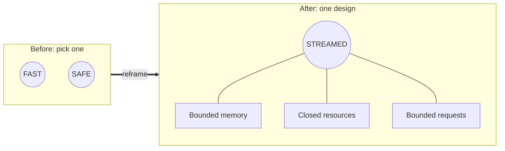

### 1b. How the log takes the app down

Use this after the Step 1 crash, when you ask "who did this to us?" Nobody
appears in the diagram, because no attacker was needed.

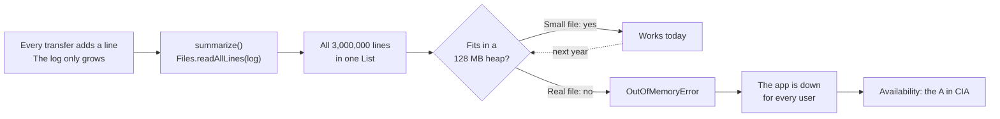

---

## Segment 2: Buffered and Streamed I/O

### 2a. Eager versus lazy

Show this right after the class predicts whether `map` runs on every line
before `reduce`, during Step 2. The eager version reads everything before it
does any work. The lazy version pulls each line through the whole pipeline,
then lets it go.

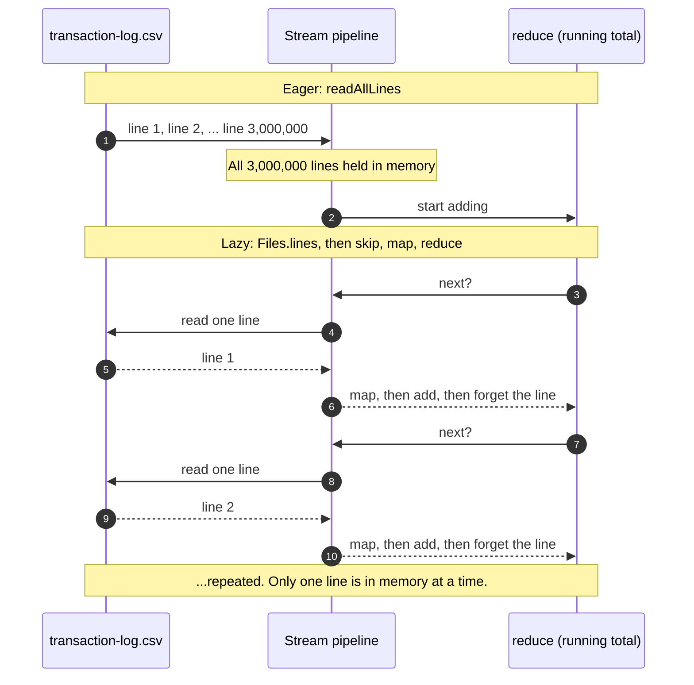

### 2b. The last operation decides

Use this for Step 3, when learners ask why switching to `Files.lines` didn't
help. Both pipelines start the same way. Only the end differs.

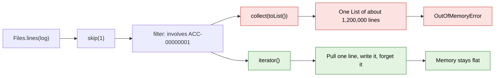

---

## Segment 3: Resource Leaks as an Availability Risk

### 3a. try-with-resources on a failure

Use this after the broken `finally` walkthrough, before Step 4. It shows what
`try (lines; writer)` does when the body throws: it closes both resources in
reverse order, and the original error still reaches the caller.

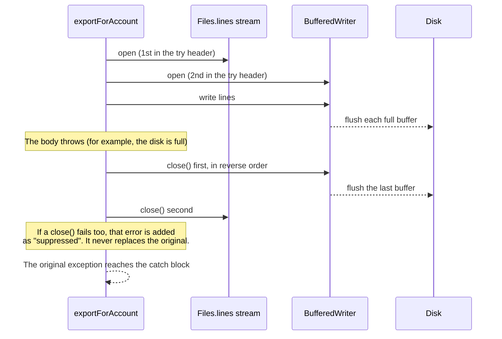

Without try-with-resources, the starter never calls `close()`. The last
buffer never reaches the disk, which is the MISMATCH that learners see in
Step 4.

### 3b. Draining the connection pool

Use this for Step 5. Read `active=5, idle=0` from the log, then point at the
last two arrows: the leak is in menu 4, but other users' work fails.

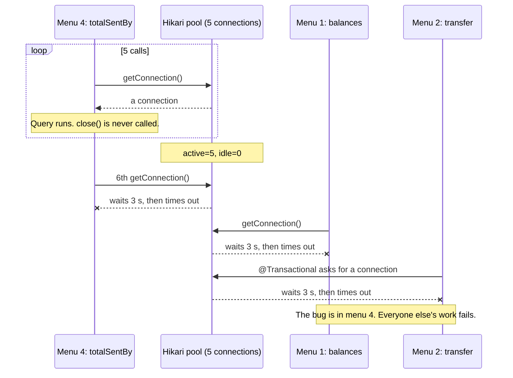

With try-with-resources, each call returns its connection to the pool, and the
pool never runs out:

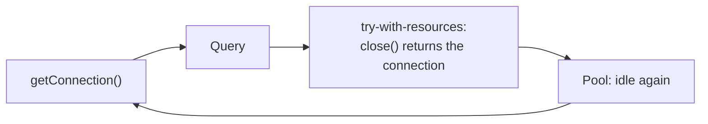

---

## Segment 4: Bounding Input and Safe Concurrency

### 4a. Reject, don't truncate

Use this for Step 6, when someone suggests `Math.min`. The middle path is the
tempting wrong fix.

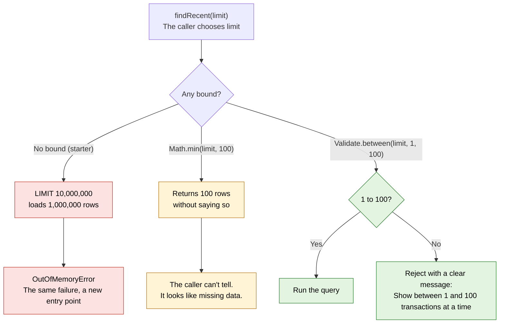

### 4b. The lost update

Use this for Step 7, after menu 8 shows lost updates. `linesProcessed += 1`
is three steps, and `volatile` doesn't make them one.

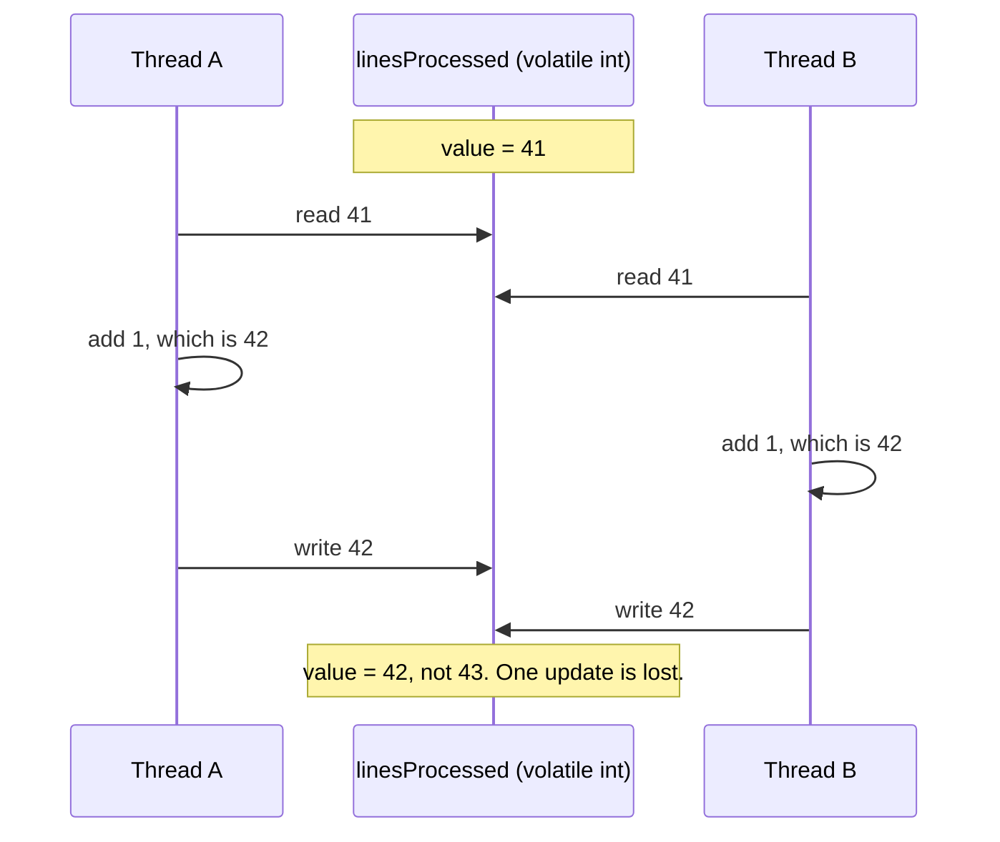

With `AtomicLong.addAndGet`, the read, add, and write happen as one step, so
the second thread always sees the first thread's result:

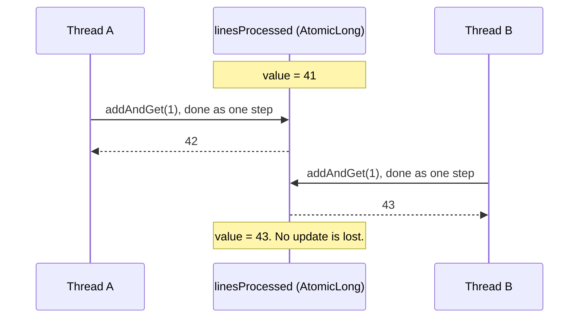

---

## Activity: Find Large Transactions in the Log

### A. All four ideas in one method

Show this **after** learners have tried the extension, when you go over
`findAtLeast` together. It shows the solution, so don't put it up first.

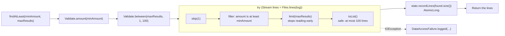

| Idea from the lesson | Where it appears |
|---|---|
| Bound the input | Both `Validate` calls run before the file is opened |
| Stream instead of load | `Files.lines`, with `limit` to stop early |
| Close every resource | try-with-resources around the stream |
| Thread-safe shared state | `ProcessingStats` is the `AtomicLong` from Step 7 |
